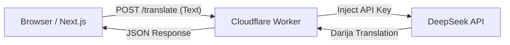

# Jokes 😄 - Premium Comedy App

A modern, high-quality jokes application built with Next.js 14 and powered by JokeAPI.

## Features

- **Premium UI**: Built with Tailwind CSS and shadcn/ui for a polished, "stand-up stage" aesthetic.
- **Smooth Animations**: Powered by Framer Motion for page transitions, card reveals, and micro-interactions.
- **Robust Filtering**: Filter by category, flags, type, language, and search string.
- **Mood Presets**: One-click configuration for "Geek Mode", "Pun Party", "Spooky", etc.
- **Rate Limit Handling**: Smart handling of API 429 errors with visual countdown.
- **Proxy API**: All requests proxied through Next.js Route Handlers to manage headers and security.
- **Rough & Ready Translation**: Translate jokes into Moroccan Darija (Arabic or Latin) using our custom AI worker.
- **Joke Mode**: Optimized translation that attempts to preserve the humor.
- **Favorites**: Save your best jokes to local storage.
- **Accessibility**: Keyboard shortcuts (`J`/`Space` for new joke, `R` for reveal, `F` for favorite).

## Tech Stack

- **Framework**: Next.js 14 (App Router)
- **Language**: JavaScript
- **Styling**: Tailwind CSS + shadcn/ui
- **Icons**: Lucide React
- **Animation**: Framer Motion
- **Toasts**: Sonner

## Getting Started

1. Install dependencies:
   ```bash
   npm install
   ```

2. Run the development server:
   ```bash
   npm run dev
   ```

3. Open [http://localhost:3000](http://localhost:3000)

## Configuration

Create a `.env` file based on `.env.example`:

```env
NEXT_PUBLIC_FRONTEND_API_BASE_URL="https://jokes-translator.essadikine.workers.dev"
NEXT_PUBLIC_FRONTEND_TRANSLATE_PATH="/translate"
```

## Architecture & Workflow 🏗️
 
This project utilizes a secure, split-architecture to handle AI translations without exposing keys:
 
1.  **Frontend (Next.js App Router)**
    *   **Role**: User Interface & Interactivity.
    *   **Action**: User clicks "Translate".
    *   **Security**: **No API keys** are stored here. It only knows the public URL of the Cloudflare Worker.
 
2.  **Middle Layer (Cloudflare Worker)**
    *   **Role**: Secure Proxy & Logic Handler.
    *   **Action**: Receives the request, validates it, and appends the `DEEPSEEK_API_KEY` (stored as a secure environment variable).
    *   **Security**: The API key acts as a secret on the edge, never leaving strict server-side bounds.
 
3.  **AI Engine (DeepSeek LLM)**
    *   **Role**: Translation & Cultural Adaptation.
    *   **Action**: Processes the English joke and returns a localized Moroccan Darija version (Arabic script or Latin).
 
### Flow Diagram
 

 
## API Structure

The app uses a proxy layer at `/app/api/**` to communicate with `v2.jokeapi.dev`. This ensures client-side CORS safety and centralized header management (e.g. rate limits).

- `GET /api/jokes`: Main endpoint. Supports standard JokeAPI parameters.
- `GET /api/meta/{info|categories|...}`: Metadata endpoints.

## Keyboard Shortcuts

- **J** / **Space**: Get a new joke
- **Enter**: Get a new joke
- **Alt + J**: Get a new joke (alternate)
